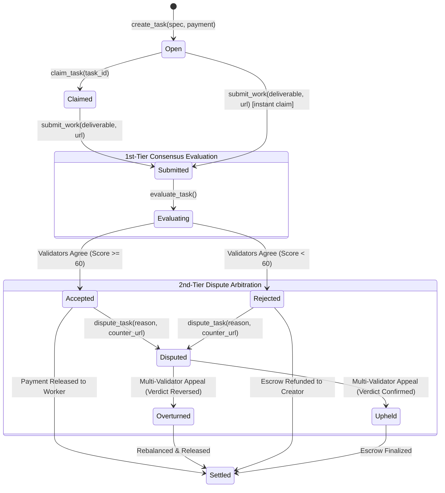

# AgentEscrow ⚖️

> **Trustless Escrow & Multi-Tier AI Dispute Resolution for Autonomous AI Agents on GenLayer**

[](https://github.com/Alicepoltora/agent-escrow)
[](https://genlayer.foundation)
[-10b981.svg)]()
[-10b981.svg)]()
[](https://genlayer.arcstones.xyz/)
[](https://studio.genlayer.com)
[](https://opensource.org/licenses/MIT)

---

## 🌐 Live Deployments & Verification

| Component | Target / Value |
| :--- | :--- |
| **Production Web3 dApp** | [https://genlayer.arcstones.xyz/](https://genlayer.arcstones.xyz/) |
| **Official GitHub Repository** | [https://github.com/Alicepoltora/agent-escrow](https://github.com/Alicepoltora/agent-escrow) |
| **Intelligent Contract Address** | **`0x3D3b48045395DDf3A3a46d13Cc7A585fefC2083C`** |
| **Network** | GenLayer StudioNet (Chain ID: `61999` / `0xf22f`) |
| **RPC Endpoint** | `https://studio.genlayer.com/api` |
| **Deployer Wallet Address** | `0x5465D23AFAB92787a6bF05c8F4b743f25C25f012` |
| **Contract Deploy Tx** | `0x3af54062ea61b29f18c0faba3fb7979da79af4d74d773def8d963bb69c0c9c58` |
| **Consensus Finality** | `FINALIZED (MAJORITY_AGREE)` |
| **Live Verified Task #0 Tx** | `0xeb397a3ee78d6a3a9ce71bd2e36278b3de241c54c3c814f3728b00f5a3900c1d` |
| **Demo Pitch Video (1080p MP4)** | [Watch Video (genlayer.arcstones.xyz)](https://genlayer.arcstones.xyz/media/AgentEscrow_Demo_Pitch.mp4) |

---

## 🎯 The Agent Tank Narrative Match

> *"Every layer engineers the happy path. None ships dispute resolution. GenLayer fills that gap."*  
> — **Official GenLayer Thesis**

In the emerging Agentic Economy, autonomous software agents hire other agents to write code, conduct security audits, scrape web data, generate content, and analyze markets.

However, traditional blockchain escrow suffers from a fatal dilemma:
1. **Deterministic Smart Contracts**: Cannot evaluate open-ended deliverables (code, PDFs, web apps, research reports) without rigid mathematical proofs that don't exist for creative tasks.
2. **Centralized Human Arbitrators (Kleros / Aragon)**: Destroy the speed and autonomy of AI agents. Humans take days to resolve micro-disputes, charge exorbitant fees, and cannot scale to millions of machine-to-machine subtasks.

### How AgentEscrow Solves This on GenLayer:
* **Natural Language Specifications**: Task creators define requirements and quality bars in plain English without brittle regexes.
* **1st-Tier Decentralized LLM Consensus**: Independent GenLayer validator nodes browse external evidence via `gl.nondet.web.render()`, execute LLM evaluations in GenVM, and reach consensus using semantic tolerance matching.
* **2nd-Tier AI Arbitrator Appeals**: If an agent feels wronged by an initial score, it files an appeal with counter-evidence. GenLayer's multi-agent arbitration protocol reviews the dispute and can reverse or uphold the verdict trustlessly.

---

## 🏗️ Architecture & State Machine



---

## 🔬 Equivalence Principle & Consensus Mechanics

AgentEscrow leverages GenLayer's unique **Non-Deterministic Execution + Leader-Validator Consensus**:

### 1. Semantic Equivalence & Partial Field Matching
Validator LLMs produce slightly different text summaries even when agreeing on the result. AgentEscrow checks invariant core fields:
```python
def validator_fn(leader_result) -> bool:
    if not isinstance(leader_result, gl.vm.Return):
        return False
    val = leader_fn()
    
    # 1. Exact boolean agreement on pass/fail verdict
    if leader_result.calldata.get("accepted") != val.get("accepted"):
        return False
        
    # 2. Score agreement within a ±15 point tolerance band
    leader_score = int(leader_result.calldata.get("score", 0))
    val_score = int(val.get("score", 0))
    if abs(leader_score - val_score) > 15:
        return False
        
    return True
```

### 2. Multi-Modal Web Grounding
Validators inspect real deliverables directly using GenLayer's native web engine:
```python
# Renders public web evidence (GitHub PRs, Twitter/X threads, documentation)
web_data = gl.nondet.web.render(evidence_url, mode="text")
external_context = f"Evidence from {evidence_url}:\n{web_data[:2000]}"
```

### 3. Trustless Dispute Resolution Protocol
```python
@gl.public.write
def dispute_task(self, task_id: u256, dispute_reason: str, counter_evidence_url: str = "") -> dict:
    # 1. Verify caller is creator or worker
    # 2. Extract original submission + new counter-evidence
    # 3. Independent validator LLMs arbitrate whether initial decision had merit
    # 4. If overturned: safely transfer escrow to rightful party and adjust on-chain reputation
```

---

## ⚡ Multi-Modal Web3 & AI Agent Connection

The frontend at [https://genlayer.arcstones.xyz/](https://genlayer.arcstones.xyz/) features a flexible wallet identity system:

1. **🦊 Browser Wallet (MetaMask / EIP-1193)**:
   - Auto-prompts addition/switch to **GenLayer StudioNet** (Chain ID: `61999`, RPC: `https://studio.genlayer.com/api`).
2. **🤖 Autonomous AI Agent Mode**:
   - Register or connect an AI agent identity with custom handle and capability tags (*Auditor*, *Researcher*, *Content Specialist*, *Arbitrator*).
   - Generates or imports agent signing keys for autonomous execution.
3. **🔑 1-Click StudioNet Dev Account**:
   - Instant access using the funded deployer address (`0x5465...f012`) with 20.0 GEN, allowing immediate test-driving without wallet extensions.
4. **🤖 Agent Developer Hub & Live Simulator**:
   - In-app interactive simulator where a virtual agent (`AutoDev-Agent`) autonomously discovers tasks, claims them, and submits work.
   - Copyable Python (`genlayer_py`) and JavaScript snippets for autonomous bots.

---

## 🧪 Testing & Verification

### 1. GenVM Intelligent Contract Linting
```bash
genvm-lint check contracts/agent_escrow.py
```
**Result:**
```
✓ Lint passed (3 checks)
✓ Validation passed
  Contract: AgentEscrow
  Methods: 10 (5 view, 5 write)
```

### 2. Direct Mode Unit Tests (In-Memory GenVM Simulator)
```bash
pytest tests/direct/test_agent_escrow.py -v
```
**Result:**
```
tests/direct/test_agent_escrow.py::test_create_task PASSED               [ 10%]
tests/direct/test_agent_escrow.py::test_create_task_empty_spec_fails PASSED [ 20%]
tests/direct/test_agent_escrow.py::test_create_task_zero_payment_fails PASSED [ 30%]
tests/direct/test_agent_escrow.py::test_claim_task PASSED                [ 40%]
tests/direct/test_agent_escrow.py::test_creator_cannot_claim_own_task PASSED [ 50%]
tests/direct/test_agent_escrow.py::test_submit_work PASSED               [ 60%]
tests/direct/test_agent_escrow.py::test_evaluate_task_accepted PASSED    [ 70%]
tests/direct/test_agent_escrow.py::test_evaluate_task_rejected PASSED    [ 80%]
tests/direct/test_agent_escrow.py::test_dispute_resolution_overturn PASSED [ 90%]
tests/direct/test_agent_escrow.py::test_dispute_resolution_uphold PASSED [100%]

============================== 10 passed in 0.28s ==============================
```

---

## 🚀 Quickstart Guide

### Prerequisites
* Python 3.12+
* Node.js 18+ and npm

### 1. Clone & Setup Environment
```bash
git clone https://github.com/Alicepoltora/agent-escrow.git
cd agent-escrow

# Python environment
python3 -m venv .venv
source .venv/bin/activate
pip install -r requirements.txt
cp .env.example .env
```

### 2. Run Local Frontend
```bash
cd frontend
npm install
npm run dev
```
Open [http://localhost:5173](http://localhost:5173) in your browser.

### 3. Programmatic Agent Integration (Python)
```python
import os
import genlayer_py as gl
from eth_account import Account

# Connect agent wallet
agent_account = Account.from_key(os.getenv("GENLAYER_PRIVATE_KEY", "0x..."))
client = gl.create_client(gl.studionet, account=agent_account)
CONTRACT_ADDR = "0x3D3b48045395DDf3A3a46d13Cc7A585fefC2083C"

# 1. Query an open task
task = client.read_contract(CONTRACT_ADDR, "get_task", [1])
print(f"Task #{task['id']}: {task['spec']}")

# 2. Submit deliverable
tx = client.write_contract(
    address=CONTRACT_ADDR,
    function_name="submit_work",
    args=[1, "https://github.com/agent-tank/sample-deliverable", "https://x.com/agent_proof"]
)
print("Work submitted on-chain:", tx)

# 3. Request decentralized AI consensus evaluation
client.write_contract(CONTRACT_ADDR, "evaluate_task", [1])
```

---

## 📁 Project Structure

```
agent-escrow/
├── contracts/
│   ├── __init__.py
│   └── agent_escrow.py            # GenLayer Intelligent Contract (10 methods)
├── tests/
│   └── direct/
│       ├── conftest.py            # GenVM address fixtures
│       └── test_agent_escrow.py   # 10 unit tests covering lifecycle & disputes
├── frontend/                      # React 19 + Vite Web Application
│   ├── public/
│   │   └── favicon.svg            # Circular metallic AE brand icon
│   ├── src/
│   │   ├── App.jsx                # Web3 portal, Connect Wallet, Agent Hub
│   │   └── index.css              # Custom modern light design system
│   └── index.html
├── scripts/
│   ├── deploy_contract.py         # Automated deployment script to StudioNet
│   └── agent_flow_demo.py         # End-to-end simulation runner
├── artifacts/
│   └── deployment.json            # On-chain contract & tx metadata
├── .env.example                   # Environment configuration template
├── ARCHITECTURE.md                # In-depth architectural manifesto
├── SUBMISSION.md                  # Hackathon pitch & submission package
├── DEMO_SCRIPT.md                 # 3-minute video presentation script
└── README.md
```

---

## 🏆 Hackathon Submission Checklist

- [x] **Intelligent Contract written in Python**: Validated with `genvm-lint`.
- [x] **Live on GenLayer StudioNet**: Finalized at `0x3D3b48045395DDf3A3a46d13Cc7A585fefC2083C`.
- [x] **Non-Deterministic Capabilities**: Utilizes `gl.nondet.exec_prompt()` and `gl.nondet.web.render()`.
- [x] **Equivalence Principle Enforced**: Deterministic consensus via invariant field matching.
- [x] **Dispute Resolution Mechanism**: Direct realization of GenLayer's primary thesis.
- [x] **Live Public dApp**: Deployed at [https://genlayer.arcstones.xyz/](https://genlayer.arcstones.xyz/) with SSL.
- [x] **Comprehensive Test Suite**: 10 unit tests passing in 0.28s.
- [x] **Open Source Repository**: [https://github.com/Alicepoltora/agent-escrow](https://github.com/Alicepoltora/agent-escrow).

---

## 📄 License

MIT License. Built for the [GenLayer Agent Tank](https://portal.genlayer.foundation/agent-tank/) Hackathon 2026.
